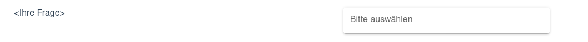

# ReFingerprint Survey

Dies ist das Hauptverzeichnis der Umfragen-Applikation.

Der Frontend-Teil wurde mit dem Vue-Framework im Material Design erstellt.

Der Backend-Teil wurde mit Node.js umgesetzt.

Beide Teile verwenden Typescript.

## Inhaltsverzeichnis

- [Installation](#installation)
- [Konfiguration](#konfiguration)
  - [Server](#konfiguration-server)
  - [Umfragen](#konfiguration-umfragen)
    - [Widgets](#konfiguration-widgets)
      - [Captcha](#konfiguration-captcha)
      - [Checkbox](#konfiguration-checkbox)
      - [Dropdown](#konfiguration-dropdown)
      - [Matrix](#konfiguration-matrix)
      - [Textbox](#konfiguration-textbox)
      - [Textfield](#konfiguration-textfield)
      - [Text](#konfiguration-text)
      - [Vector](#konfiguration-vector)
    - [Beispiel Umfrage](#beispiel-umfrage)
- [Benutzung](#benutzung)

## Installation

Container bauen:

```bash
DOCKER_BUILDKIT=1 docker build -t refingerprint .
```

Erstes Starten:

```bash
docker run -d -p 443:443 --env RECAPTCHA_SECRET=<Secret einfügen> -v "$(pwd)"<relativer Datenpfad>:/data --name refingerprint refingerprint
```

Stoppen:

```bash
docker stop refingerprint
```

Starten:

```bash
docker start refingerprint
```

## Konfiguration

- [Server](#konfiguration-server)
- [Umfragen](#konfiguration-survey)
  - [Widgets](#konfiguration-widgets)
    - [Captcha](#konfiguration-captcha)
    - [Checkbox](#konfiguration-checkbox)
    - [Dropdown](#konfiguration-dropdown)
    - [Matrix](#konfiguration-matrix)
    - [Textbox](#konfiguration-textbox)
    - [Textfield](#konfiguration-textfield)
    - [Text](#konfiguration-text)
    - [Vector](#konfiguration-vector)
  - [Beispiel Umfrage](#beispiel-umfrage)

### Konfiguration Server

Für das Starten des Servers benötigen Sie einen API-Schlüssel von ReCaptcha, welchen Sie [hier](https://www.google.com/recaptcha/intro/v3.html) in der Admin Console erhalten. Bitte achten Sie darauf, dass Sie die die reCAPTCHA Version 2 mit dem Kästchen "Ich bin kein Roboter." auswählen.

Sie erhalten einen Websitenschlüssel, welchen Sie [später](#konfiguration-captcha) benötigen, und einen Geheimen Schlüssel, welchen Sie in den obigen Befehl für das erste Starten (anstatt `<Secret einfügen>`) einfügen.

Zudem müssen Sie einen Ordner erstellen und den relativen Pfad anstatt `<relativer Pfad>` in denselben Befehl einfügen.
Dieser Ordner ist der Hauptordner für die zu erstellenden Umfragen-Ordner, welche die Beschreibung und anschließend die Rückmeldungen enthalten werden.

In diesem Ordner müssen zudem von Ihnen noch der TLS-Schlüssel und das TLS-Zertifikat abgelegt werden.

Wenn Sie das Programm lokal testen wollen, können Sie mit dem folgendem Befehl ein selbst-signiertes Zertifikat erstellen:

```bash
openssl req -newkey rsa:4096 -nodes -keyout key.pem -x509 -days 365 -out crt.pem
```

Bitte speichern Sie die beiden generierten Dateien in dem zuvor erstellten Ordner ab.

Falls Sie den Dateinamen ändern, oder die Dateien in einem Unterverzeichnis speichern möchten, müssen Sie die Umgebungsvariablen setzen.
Im Folgenden sehen Sie die Umgebungsvariablen für die TLS-Konfiguration mit deren Standardwerten:

```TOML
TLS_KEY_PATH="/data/key.pem"
TLS_CERT_PATH="/data/crt.pem"
```

Für den realen Einsatz fragen Sie bitte Ihren IT-Administrator oder erzeugen Sie ein Zertifikat für Ihre Domain und lassen dieses von einer CA unterschreiben (zum Beispiel von Let's Encrypt).

### Konfiguration Umfragen

Um eine neue Umfrage anzulegen, müssen Sie einen neuen Ordner in Ihrem Datenpfad anlegen.

Der Ordnername ist die eindeutige Bezeichnung der Umfrage und muss eine sogenannte UUID sein.
Um eine UUID zu generieren [klicken Sie hier](https://www.uuidgenerator.net/version4).

In diesem Verzeichnis werden die Antworten der Teilnehmer abgespeichert und die Beschreibung der Umfrage.

Die Beschreibung der Umfrage muss in dem Umfragenordner in der Datei `structure.json` liegen und ein valides `json`-Dokument sein.

Die Beschreibung hat folgende Form:

```json
{
  "survey": "<Hier die soeben generierte UUID einfügen>",
  "pages": [
    []
    ...
  ],
}
```

Der Pages-Wert ist ein Mehrdimensionales Array, er listet die verschiedenen Seiten auf.

Auf jeder Seite können mehrere Widgets platziert werden, deshalb ist jede Seite ein Array.

#### Konfiguration Widgets

Die Beschreibung eines Widgets ist folgendermaßen aufgebaut:

```json
{
  "type": "<Typbezeichnung>",
  "required": true|false,
  "structure": {}
}
```

Mit dem `required` Wert können Sie bestimmen, ob dieses Widget ausgefüllt werden muss oder nicht.

Mit dem `type` Wert bestimmen Sie, welches Widget Sie anzeigen möchten.
Die Werte für diesen Wert finden Sie bei der Dokumentation des jeweiligen Widgets.

Mit dem `structure` Wert konfigurieren Sie ein Widget näher.
Diese Konfiguration hängt aber von dem jeweiligen Widget ab.
Bitte entnehmen Sie das Konfigurationschema der Dokumentation des jeweiligen Widgets.

Folgende Widgets sind möglich:

- [Captcha](#konfiguration-captcha)
- [Checkbox](#konfiguration-checkbox)
- [Dropdown](#konfiguration-dropdown)
- [Matrix](#konfiguration-matrix)
- [Textbox](#konfiguration-textbox)
- [Textfield](#konfiguration-textfield)
- [Text](#konfiguration-text)
- [Vector](#konfiguration-vector)

##### Konfiguration Captcha

Stellt eine Captcha-Abfrage dar.

```json
{
  "type": "captcha",
  "required": true,
  "structure": {
    "sitekey": "<Ihr ReCaptcha Websitenschlüssel>"
  }
}
```

##### Konfiguration Checkbox

Stellt eine Frage mit vorgegebenen Antwortmöglichkeiten dar.
Es können mehrere Antwortmöglichkeiten gewählt werden.

```json
{
  "type": "checkbox",
  "required": true|false,
  "structure": {
    "question": "<Ihre Frage>",
    "selection": ["Antwortmöglichkeit A", "B", ...]
  }
}
```

**Beispiel**:


```json
{
  "type": "checkbox",
  "required": true,
  "structure": {
    "question": "<Ihre Frage>",
    "selection": ["Antwortmöglichkeit A", "B", "C", "D"]
  }
}
```

##### Konfiguration Dropdown

Stellt eine Frage mit vorgegebenen Antwortmöglichkeiten dar.
Es kann nur eine Antwortmöglichkeit gewählt werden.
Die Möglichkeiten sind erst nach einem Klick sichtbar und werden dann vertikal angezeigt.

```json
{
  "type": "dropdown",
  "required": true|false,
  "structure": {
    "items": ["Antwortmöglichkeit A", "B", ...],
    "label": "<Vorschautext>",
    "question": "<Ihre Frage>"
  }
}
```

**Beispiel**:




```json
{
  "type": "dropdown",
  "required": false,
  "structure": {
    "items": ["Antwortmöglichkeit A", "B", "C", "D"],
    "label": "Bitte auswählen",
    "question": "<Ihre Frage>"
  }
}
```

##### Konfiguration Matrix

Hier wird eine Frage gestellt und anschließend eine Tabelle gezeigt.
Pro Tabellenzeile wird ein weiterer Text angezeigt und pro Tabellenspalte gibt es eine Antwortmöglichkeit.
Pro Zeile kann nur eine Antwortmöglichkeit gewählt werden.

```json
{
  "type": "matrix",
  "required": true|false,
  "structure": {
    "question": "<Ihre Frage>",
    "structure": ["Antwortmöglichkeit A", "B", ...],
    "answers": {
      "Zeilentext 1": -1,
      "Zeilentext 2": -1,
      "Zeilentext 3": -1,
      ...
    }
  }
}
```

Sie können pro Zeile entweder -1 angeben, was keine Vorauswahl bedeutet, oder eine andere Zahl im Intervall [0, Länge des structure.structe Arrays[ angeben, sodass diese Antwortmöglichkeit bereits vorausgewählt ist.

**Beispiel**:


```json
{
  "type": "matrix",
  "required": true,
  "structure": {
    "question": "<Ihre Frage>",
    "structure": ["Antwortmöglichkeit A", "B", "C"],
    "answers": {
      "Zeilentext 1": -1,
      "Zeilentext 2": 0,
      "Zeilentext 3": 2
    }
  }
}
```

##### Konfiguration Textbox

Stellt eine Frage mit einer großen, mehrzeiligen Box dar, in welche ein Text geschrieben werden kann.

```json
{
  "type": "textbox",
  "required": true|false,
  "structure": {
    "question": "<Ihre Frage>",
    "rows": <Anzahl der Zeilen>
  }
}
```

**Beispiel**:


```json
{
  "type": "textbox",
  "required": false,
  "structure": {
    "question": "<Ihre Frage>",
    "rows": 4
  }
}
```

##### Konfiguration Textfield

Stellt eine Frage mit einer kleinen, einzeiligen Box dar, in welche ein Text geschrieben werden kann.

```json
{
  "type": "textfield",
  "required": true|false,
  "structure": {
    "question": "<Ihre Frage>"
  }
}
```

**Beispiel**:


```json
{
  "type": "textfield",
  "required": false,
  "structure": {
   "question": "<Ihre Frage>"
  }
}
```

##### Konfiguration Text

Stellt einen festen Text dar, ohne Eingabemöglichkeiten.
Der Text unterstützt Markdown-Funktionalität.

```json
{
  "type": "textwidget",
  "required": false,
  "structure": {
    "content": "<Ihr Text>"
  }
}
```

**Beispiel**:


```json
{
  "type": "textwidget",
  "required": false,
  "structure": {
    "content": "Dies ist ein schöner Text. Man kann auch **Markdown** benutzen und damit Textbestandteile *kursiv* darstellen"
  }
}
```

##### Konfiguration Vector

Stellt eine Frage mit mehreren Antwortmöglichkeiten dar, wobei nur eine Antwort ausgewählt werden kann.

```json
{
  "type": "vector",
  "required": true|false,
  "structure": {
    "question": "<Ihre Frage>",
    "selection": ["Antwortmöglichkeit A", "B", ...]
  }
}
```

**Beispiel**:


```json
{
  "type": "vector",
  "required": true,
  "structure": {
    "question": "<Ihre Frage>",
    "selection": ["Antwortmöglichkeit A", "B", "C", "D"]
  }
}
```

#### Beispiel Umfrage

Hier finden Sie eine Umfrage inklusive der Konfiguration:


```json
{
  "survey": "220d2741-376d-4ed9-861b-b9e0845d7674",
  "pages": [
    [{
      "type": "textwidget",
      "required": false,
      "structure": {
        "content": "Willkommen zu dieser *grandiosen* Umfrage!\nIch hoffe Sie haben **Spaß**!"
      }
    }],
    [{
        "type": "checkbox",
        "required": true,
        "structure": {
          "question": "<Ihre Frage>",
          "selection": [
            "Antwortmöglichkeit A",
            "B",
            "C",
            "D"
          ]
        }
      },
      {
        "type": "dropdown",
        "required": false,
        "structure": {
          "items": [
            "Antwortmöglichkeit A",
            "B",
            "C",
            "D"
          ],
          "question": "<Ihre Frage>",
          "label": "Bitte auswählen"
        }
      }
    ],
    [{
      "type": "matrix",
      "required": true,
      "structure": {
        "question": "<Ihre Frage>",
        "structure": [
          "Antwortmöglichkeit A",
          "B",
          "C"
        ],
        "answers": {
          "Zeilentext 1": -1,
          "Zeilentext 2": 0,
          "Zeilentext 3": 2
        }
      }
    }],
    [{
      "type": "vector",
      "required": true,
      "structure": {
        "question": "<Ihre Frage>",
        "selection": [
          "Antwortmöglichkeit A",
          "B",
          "C",
          "D"
        ]
      }
    }]
  ]
}
```

## Benutzung

Ihren Teilnehmern müssen Sie folgenden Link geben:

```URL
https://<IhreDomain>/?<Ihre Umfragen-UUID>
```

In dem Datenpfad unter Ihrer Umfragen-UUID finden Sie die Rückmeldungen Ihrer Teilnehmer in jeweiligen `json`-Dateien.
